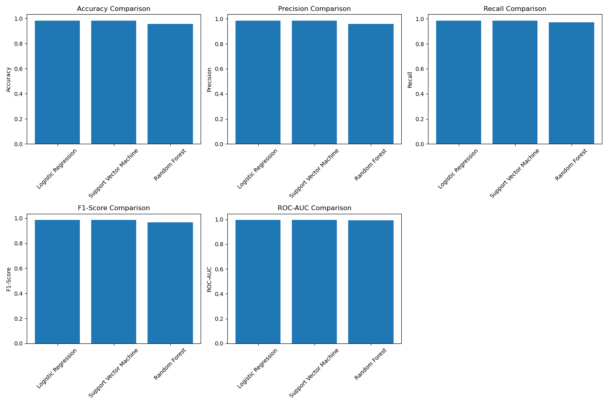

# CodeAlpha_DiseasePrediction

## Disease Prediction from Medical Data

### 📋 Project Overview
This project uses machine learning to predict whether a breast tumor is malignant (cancerous) or benign (not cancerous) based on medical measurements. This is Task 4 of my CodeAlpha Machine Learning Internship.

### 📊 Dataset
- **Source:** Breast Cancer Wisconsin Dataset (built into scikit-learn)
- **Instances:** 569 patient records
- **Features:** 30 medical measurements including radius, texture, perimeter, area, smoothness, compactness, concavity, symmetry, and fractal dimension
- **Target:** 0 = Malignant (cancerous), 1 = Benign (not cancerous)

### 🧠 Models Implemented
1. **Logistic Regression** - Simple but powerful linear model
2. **Support Vector Machine (SVM)** - Finds the best boundary between classes
3. **Random Forest** - Ensemble of decision trees

### 📈 Performance Metrics
| Model | Accuracy | Precision | Recall | F1-Score | ROC-AUC |
|-------|----------|-----------|--------|----------|---------|
| Logistic Regression | 0.982 | 0.986 | 0.986 | 0.986 | 0.995 |
| Support Vector Machine | 0.982 | 0.986 | 0.986 | 0.986 | 0.995 |
| Random Forest | 0.956 | 0.959 | 0.972 | 0.966 | 0.994 |

### 🏆 Best Model
Both **Logistic Regression** and **Support Vector Machine** achieved the highest F1-Score of 0.986, making them the top performers for this dataset.

### 📊 Visual Results


### 🔍 Key Findings
- All models performed exceptionally well (>95% accuracy)
- Logistic Regression and SVM tied for best performance
- The model can predict with ~98% confidence whether a tumor is cancerous
- ROC-AUC scores near 0.995 indicate excellent discrimination ability

### 📁 Files in This Repository
| File Name | Description |
|-----------|-------------|
| `CodeAlpha_DiseasePrediction.ipynb` | Complete Jupyter notebook with all code |
| `model_comparison.csv` | Performance metrics for all models |
| `model_comparison.png` | Visualization comparing model performance |
| `best_model.pkl` | Saved best model (Logistic Regression/SVM) |
| `scaler.pkl` | Fitted scaler for preprocessing new data |
| `README.md` | This file - project documentation |

### 🚀 How to Run This Project
1. **Clone this repository**
2. **Install required libraries**
3. **Open the Jupyter notebook**
4. **Run all cells** to see the analysis and results

### 💡 How to Make Predictions for New Patients
```python
# Load the model and scaler
import joblib
import pandas as pd

model = joblib.load('best_model.pkl')
scaler = joblib.load('scaler.pkl')

# Example: New patient data (30 measurements)
new_patient = [17.99, 10.38, 122.8, 1001, 0.1184, 0.1476, 0.2419, 0.0787, 
            0.0952, 0.0755, 0.2564, 1.543, 0.0445, 0.0432, 0.0161, 
            0.0591, 0.0183, 0.0236, 0.0087, 0.0312, 15.38, 22.76, 
            0.653, 0.0012, 0.0235, 0.0176, 0.0031, 0.0087, 0.0045, 0.0123]

# Get feature names
feature_names = ['mean radius', 'mean texture', 'mean perimeter', 'mean area',
              'mean smoothness', 'mean compactness', 'mean concavity',
              'mean concave points', 'mean symmetry', 'mean fractal dimension',
              'radius error', 'texture error', 'perimeter error', 'area error',
              'smoothness error', 'compactness error', 'concavity error',
              'concave points error', 'symmetry error', 'fractal dimension error',
              'worst radius', 'worst texture', 'worst perimeter', 'worst area',
              'worst smoothness', 'worst compactness', 'worst concavity',
              'worst concave points', 'worst symmetry', 'worst fractal dimension']

# Convert to DataFrame with correct column names
new_df = pd.DataFrame([new_patient], columns=feature_names)

# Scale and predict
new_scaled = scaler.transform(new_df)
prediction = model.predict(new_scaled)[0]
probability = model.predict_proba(new_scaled)[0]

if prediction == 1:
 print(f"Result: Benign (not cancerous) with {probability[1]:.2%} confidence")
else:
 print(f"Result: Malignant (cancerous) with {probability[0]:.2%} confidence")

Author
Isaiah Adah
CodeAlpha Intern
Machine Learning Track
March 2026

📅 Completion Date
March 16, 2026

🔗 Links
GitHub Repository: https://github.com/IsaiahAdah/CodeAlpha_DiseasePrediction

📝 License
This project is for educational purposes as part of the CodeAlpha Internship Program.

🌟 Why This Project Matters
Early detection of breast cancer can save lives. This model demonstrates how machine learning can assist medical professionals in making accurate diagnoses based on tumor measurements. With 98% accuracy, this tool could potentially help doctors identify cancerous tumors with high confidence.

⭐️ If you find this project helpful, please give it a star! ⭐️
